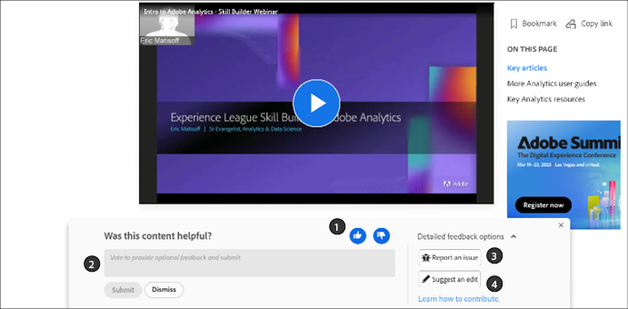

# Guía del colaborador para la documentación de Adobe

En esta guía se describe cómo puede contribuir a la ayuda de empresarial de Adobe en Experience League.

## ¿Qué es la documentación colaborativa?

La documentación técnica y el contenido de habilitación de Adobe Experience Cloud y otros productos de Adobe Enterprise se basan en los principios de código abierto que utilizan las soluciones GitHub, Markdown y Adobe Experience Cloud.

Este modelo de código abierto mejora la calidad del contenido y la comunicación entre clientes y equipos de documentación y de producto. Ahora, en cada una de las páginas es posible valorar la utilidad del contenido, registrar problemas e incluso contribuir con sugerencias de contenido mediante solicitudes de extracción (PR) Git. Los equipos de documentación de Adobe supervisan diariamente las contribuciones y los problemas, y realizan las actualizaciones, las modificaciones y los ajustes necesarios.

## Uso de la documentación de colaborativa

Como usuario de este material, e independientemente de si es empleado, socio, cliente o incluso cliente potencial, tiene la opción de contribuir a la documentación de varias formas sencillas.

* Valore la utilidad de la página ❶ y escriba un comentario opcional ❷
* Informe de un problema en una página específica (requiere iniciar la sesión en Git) ❸
* Envíe desde una edición rápida hasta la creación de artículos completos, con recursos y ejemplos de código (requiere iniciar la sesión en Git) ❹

Estas opciones aparecen en la parte inferior de la página unos segundos después de abrirla. Si descarta el área de comentarios, puede volver a cargar la página para que vuelva a aparecer.

En esta guía se describe todo lo que necesita saber para interactuar con este conjunto de materiales y contribuir a su creación.

<!--
>[!IMPORTANT]
>All repositories that publish to docs.adobe.com have adopted the [Adobe Open Source Code of Conduct](../code-of-conduct.md) or the [.NET Foundation Code of Conduct](https://dotnetfoundation.org/code-of-conduct). For more information, see the [Contributing](../contributing.md) article.
>
> Minor corrections or clarifications to documentation and code examples in public repositories are covered by the [Adobe Documentation Terms of Use](https://www.adobe.com/legal/terms.html). New or significant changes generate a comment in the pull request, asking you to submit an online Contribution License Agreement (CLA) if you are not an employee of Adobe. We need you to complete the online form before we can review or accept your pull request.
-->

## Valore la utilidad de la página y escriba un comentario

Unos segundos después de abrir una página, aparece un área de comentarios en la parte inferior de la página. Haga clic en el botón hacia arriba o hacia abajo para indicar si la página era útil.

No dude en dejar un comentario para proporcionar comentarios adicionales.

## Realice ediciones rápidas en documentos existentes

Si desea proporcionar comentarios más detallados, realizar ediciones rápidas es una buena manera de corregir pequeños errores y omisiones en los documentos. Cuando se sugiere una edición, se envía una solicitud de extracción (PR) para enviarnos la solución/sugerencia y nosotros podemos vetar, aprobar y publicar dicha sugerencia.

1. Si le parece aceptable, firme el [Acuerdo de licencia para colaboradores (CLA)](http://opensource.adobe.com/cla.html).

   Solo es necesario que envíe el CLA de Adobe una vez.

1. En el área de comentarios que aparece al final del artículo, haga clic en **[!UICONTROL Detailed feedback options]** y haga clic en **[!UICONTROL Suggest an edit]** para ir al archivo de origen Markdown en GitHub.

   

1. Haga clic en el icono de lápiz para editar el artículo.

   >[!NOTE]
   >
   >Si el icono de lápiz está deshabilitado, debe iniciar sesión en su cuenta de GitHub o crear una nueva.

   

1. Realice los cambios en el editor web.

   Puede hacer clic en la pestaña **[!UICONTROL Preview changes]** para comprobar el formato del cambio.

1. Después de realizar los cambios, desplácese hasta la parte inferior de la página.

   Introduzca un título y una descripción para su PR y, a continuación, haga clic en **[!UICONTROL Propose file change]** como se muestra en el siguiente gráfico:

   

   >[!NOTE]
   >
   >Si recibe un mensaje de error de validación acerca la firma de un acuerdo de licencia de colaborador (Contributor License Agreement, CLA), haga clic en **[!UICONTROL Details]** para abrir el acuerdo de licencia. Si acepta las condiciones, firme el acuerdo. A continuación, cierre y abra la solicitud de extracción, y continúe.

Es así de sencillo. Los integrantes del equipo de documentación revisarán y fusionarán la solicitud de extracción. ¡Gracias! 

## Informar de un problema

Otra forma sencilla de comunicar un problema con un contenido es utilizar **[!UICONTROL Report an issue]**.

1. En el área de comentarios que aparece al final del artículo, haga clic en **[!UICONTROL Detailed feedback options]** y haga clic en **[!UICONTROL Report an issue]** para ir al archivo de origen Markdown en GitHub.

   

   >[!NOTE]
   >
   >Para informar de un problema, debe iniciar sesión en su cuenta de GitHub o crear una cuenta.

   Al hacer clic en este vínculo, podrá registrar una incidencia rápida con Experience League mediante la interfaz de problemas de GitHub.

   La dirección URL de la página con el problema se rellena automáticamente en el campo de descripción.

1. Añada el título, escriba una breve descripción del problema y haga clic en *Enviar problema nuevo*.

   

Al enviar un problema, se notifica al equipo de contenido de esta página, que puede resolverlo. Cuando actualicemos el contenido, le avisaremos en la interfaz de problemas de GitHub y le notificaremos por correo electrónico cualquier actualización o cierre.

## Explicación de los permisos de GitHub

La edición de la interfaz de usuario de GitHub se adapta a sus permisos de repositorio. Las imágenes anteriores son las adecuadas para los colaboradores que no tienen permisos de escritura en el repositorio de destino. GitHub crea automáticamente una ramificación del repositorio de destino en su cuenta. Si tiene acceso de escritura al repositorio de destino, GitHub crea una rama nueva en dicho repositorio.

Adobe usa solicitudes de extracción para todos los cambios, incluso para los colaboradores que tienen acceso de escritura. La mayoría de los repositorios tienen la ramificación `main` protegida para que las actualizaciones deban enviarse como solicitudes de extracción.

La edición en el navegador es mejor para cambios menores o poco frecuentes. Si realiza grandes contribuciones o utiliza características de Git avanzadas, le recomendamos [que ramifique el repositorio y trabaje de forma local](setup/full-workflow.md).

## Proporcionar comentarios

Con un conjunto de soluciones tan grande como el de Adobe, la documentación siempre está en constante evolución. Si encuentra errores, registre un problema; si tiene sugerencias sobre el material, háganoslo saber. Díganos qué información estaba buscando. Si no encontró lo que necesitaba, háganoslo saber. Si tiene dificultades para completar su tarea, indíquenos cómo podemos ayudarle a conocer nuestras soluciones.

Gracias de parte del equipo de Documentación colaborativa y de todos los redactores y productores de contenidos de Experience League.
