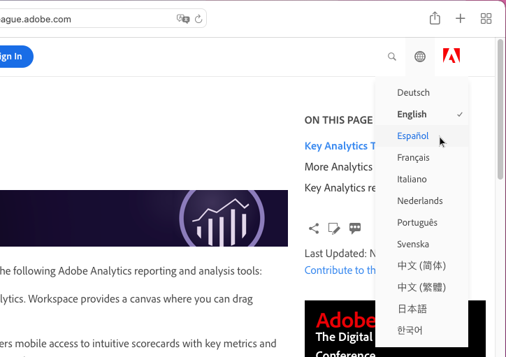
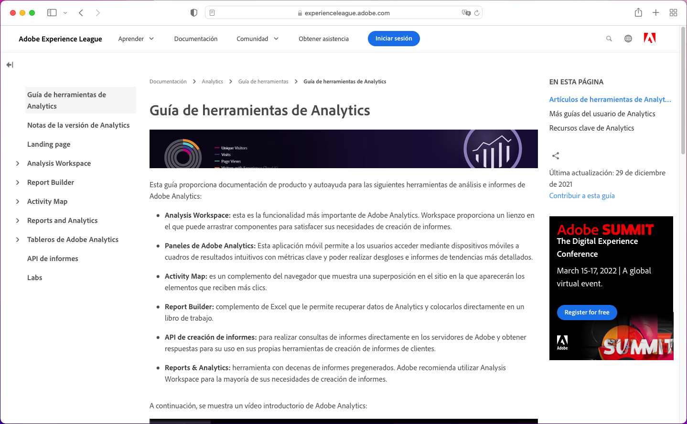
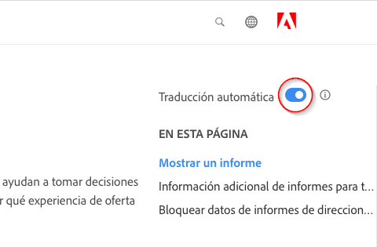
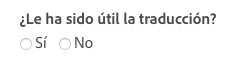

# Compatibilidad de idiomas para la documentación de productos de Adobe Experience Cloud

Adobe conoce la importancia de la documentación del producto, la ayuda y asistencia. Por eso, este contenido debería estar disponible en los idiomas compatibles con los productos de Adobe. Para conseguir este objetivo, Adobe ofrece una experiencia de traducción única que le permite seleccionar el idioma de su elección y proporcionar información sobre la calidad del contenido traducido.

## Seleccione un idioma

Puede ver la documentación de productos de Adobe Experience Cloud en la mayoría de los idiomas.

1. Vaya a la [documentación del producto](https://helpx.adobe.com/es/support/experience-cloud.html) de Experience Cloud.

1. Busque una página de ayuda (por ejemplo, [Analytics](https://docs.adobe.com/content/help/es-ES/analytics/landing/home.html)).

1. Haga clic en el selector de idioma (icono del globo terráqueo) y, a continuación, seleccione un idioma.

   

   La página se muestra en el idioma seleccionado.

   

   En los casos en que la versión en su idioma aún no esté disponible, Adobe puede traducir automáticamente su contenido. El servicio de traducción automática del Adobe muestra un mensaje en la parte superior de la barra de navegación derecha:

   

   El contenido puede mostrarse en su idioma automáticamente, o puede hacer clic en un enlace para activar la traducción. (Este escenario puede darse cuando haga clic en el hipervínculo para regresar a la fuente en inglés desde la página traducida. Le da la opción de ver la página traducida cuando quiera). En cualquier momento puede volver a la versión original en inglés.

   En algunos casos, el contenido original podría variar debido a actualizaciones recientes o publicaciones realizadas antes de completar las traducciones. Al hacer clic en su idioma en el menú desplegable, verá una notificación (en la barra horizontal, de color azul claro, en la parte superior de la página) que le indica que la página se tradujo automáticamente de la versión anterior y que tiene contenido actualizado que estará disponible en breve. Se le ofrecerá la opción de ver el contenido original en inglés más reciente en una nueva ventana del navegador, si lo prefiere.

## Razones para usar la traducción automática

Adobe usa diferentes funcionalidades de traducción automática para publicar el contenido de soporte del producto en varios idiomas, lo más cerca posible del momento de creación del contenido. Dado que el contenido de soporte es esencial para el uso del producto, damos prioridad a la traducción del contenido por parte de profesionales cualificados, pero también podemos optar por la traducción automática cuando la velocidad y la urgencia sean más importantes.

La traducción automática es una herramienta muy utilizada en Internet y, además, es una buena opción para recopilar información. La traducción automática se usa para contenidos de bases de conocimientos, en las que el factor humano se reduce al mínimo. Aunque ha habido grandes avances tecnológicos en los últimos años, las traducciones generadas automáticamente pueden contener imprecisiones y errores ocasionales en el lenguaje y el significado.

### Traducción automática a través del explorador

Si ha configurado las preferencias de su explorador para que traduzca automáticamente cualquier página a su idioma, tenga en cuenta que las traducciones resultantes serán diferentes de las obtenidas a través de la página de Adobe. Esto se debe a que el servicio ofrecido por el explorador pueden ser traducciones predeterminadas, mientras que las traducciones de Adobe se han personalizado para adherirse a las directrices de estilo y la terminología de Adobe. Para obtener resultados óptimos de traducción automática, le recomendamos que, en las preferencias de su explorador, deshabilite la traducción automática para este sitio o que haga clic en **Nunca traducir**.

### Problemas conocidos

Es posible que, ocasionalmente, encuentre errores en la traducción automática, como traducciones incompletas, caracteres dañados o problemas con el diseño de la página. Estas se deben a las diferentes herramientas tecnológicas de creación, publicación o traducción de contenido que utiliza Adobe. Haremos todo lo posible para enumerar los problemas conocidos
aquí:

| **ID DEL PROBLEMA** | **DESCRIPCIÓN** | **ESTADO** |
|--------------|-------------------------------------------------------------------------------------|------------|
| G11N3558 | Algunas páginas de Audience Manager aparecen la mitad en inglés y la mitad traducidas (francés, español). | ABRIR |

### Comentarios

Siempre que el contenido se traduce automáticamente, ya sea por defecto o por acción del usuario, existe la opción de proporcionar comentarios a Adobe sobre las traducciones. En la
barra horizontal de color azul claro de la parte superior de la página, puede responder &quot;Sí&quot; o &quot;No&quot; a la pregunta &quot;¿Fue útil esta traducción?&quot;. Adobe recopila las valoraciones
y analiza los datos recopilados para tomar decisiones sobre la traducción de contenido. Valoramos sus comentarios y le animamos a que responda.

En el futuro, podrá no solo valorar la traducción, sino también registrar un problema, sugerir mejoras e incluso solicitar
más idiomas. Algunas de estas características ya están disponibles en las páginas en inglés. A largo plazo, creemos que esto ayudará a Adobe a mejorar la calidad del contenido
de estas páginas.

<!--

-->

### Aviso de descargo de responsabilidad de traducción

Adobe utiliza un programa de traducción automática para traducir textos a varios idiomas. Tenga en cuenta que las traducciones automáticas son literales y pueden contener errores. Adobe no garantiza la precisión, fiabilidad o puntualidad de las traducciones proporcionadas. Adobe no se responsabilizará de las pérdidas o daños ocasionados por depender de la precisión o fiabilidad de la información traducida. Si hay diferencias entre el inglés y otro idioma, la versión en inglés prevalecerá.

Si desea comunicar un error o una inexactitud en la traducción, le recomendamos que se ponga en contacto con nosotros.
