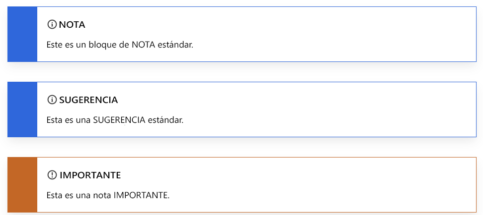
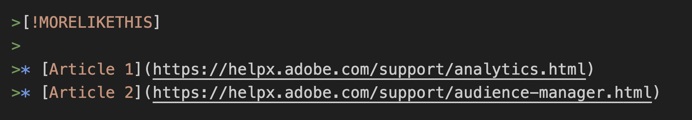

# Cómo utilizar Markdown para escribir documentación técnica

Los artículos técnicos de Adobe están escritos con un lenguaje de marcado ligero llamado [Markdown](https://daringfireball.net/projects/markdown/), que es fácil de leer y aprender.

Como el contenido Adobe Docs se almacena en GitHub, puede utilizar una versión de Markdown denominada [GitHub Flavored Markdown (GFM)](https://help.github.com/categories/writing-on-github/), que proporciona funcionalidad adicional para satisfacer necesidades comunes de aplicación de formato. Además, el Adobe Markdown ampliado proporciona varias formas que admiten determinadas funciones relacionadas con la ayuda, como notas, sugerencias y vídeos incrustados.

## Conceptos básicos de Markdown

Las secciones siguientes describen los conceptos básicos de la creación en Markdown.

### Encabezados

Para crear un encabezado, utilice el símbolo de almohadilla (#) al principio de una línea:

```
# This is level 1 (article title)
## This is level 2
### This is level 3
#### This is level 4
##### This is level 5
```

### Texto básico

En Markdown, un párrafo no requiere sintaxis especial.

Para aplicar **negrita** al texto, se escribe entre dos asteriscos. Para aplicar *cursiva* al texto, se escribe entre un solo asterisco:

```markdown
   This text is **bold**.
   This text is *italic*.
   This text is both ***bold and italic***.
```

Para ignorar los caracteres de formato de Markdown, ponga \ antes del carácter:

```markdown
This is not \*italicized\* type.
```

### Listas numeradas y listas con viñetas

Para crear listas numeradas, empiece una línea con `1.` or `1)`, pero no mezcle los formatos dentro de la misma lista. No es necesario especificar los números. GitHub lo hace por usted.

```markdown
1. This is step 1.
1. This is the next step.
1. This is yet another step, the third.
```

Visualización:

1. This is step 1.
1. This is the next step.
1. This is yet another step, the third.

Para crear listas de viñetas, empiece una línea con \*, - o +, pero no mezcle los formatos dentro de la misma lista. (No mezcle formatos de viñetas, como \* y \+, dentro del mismo documento).

```markdown
* First item in an unordered list.
* Another item.
* Here we go again.
```

Visualización:

* First item in an unordered list.
* Another item.
* Y otro más.

También puede incrustar listas dentro de listas y añadir contenido entre elementos de la lista.

```markdown
1. Set up your table and code blocks.
1. Perform this step.

   

1. Make sure that your table looks like this: 

   | Hello | World |
   |---|---|
   | How | are you? |  

1. This is the fourth step.

   >[!NOTE]
   >
   >This is note text.

1. Do another step.
```

Visualización:

1. Set up your table and code blocks.
1. Perform this step.

   

1. Make sure that your table looks like this:

   | Hello | World |
   |---|---|
   | How | are you? |

1. This is the fourth step.

   >[!NOTE]
   >
   >Este es el texto de la nota.

1. Do another step.

### Tablas

Las tablas no forman parte de la especificación principal de Markdown, pero Adobe las admite en cierta medida. Markdown no admite listas de líneas múltiples en celdas. La práctica recomendada es evitar el uso de varias líneas en las tablas. Puede crear tablas utilizando la barra vertical (|) para definir columnas y filas. Los guiones crean el encabezado de cada columna, mientras que las barras verticales separan las columnas. Incluya una línea en blanco antes de la tabla para que se muestre correctamente.

```markdown
| Header | Another header | Yet another header |
|--- |--- |--- |
| row 1 | column 2 | column 3 |
| row 2 | row 2 column 2 | row 2 column 3 |
```

Visualización:

| Header | Another header | Yet another header |
|--- |--- |--- |
| row 1 | column 2 | column 3 |
| row 2 | row 2 column 2 | row 2 column 3 |

Las tablas sencillas funcionan correctamente en Markdown. Sin embargo, es difícil trabajar con tablas que incluyen varios párrafos o listas dentro de una celda. Para dicho contenido, recomendamos utilizar un formato diferente, como encabezados y texto.

Para obtener más información sobre cómo crear tablas, consulte:

* [Organización de información con tablas de GitHub](https://docs.github.com/es/github/writing-on-github/organizing-information-with-tables)
* La aplicación web [Markdown Tables Generator](https://www.tablesgenerator.com/markdown_tables)
* [Convertir tablas HTML a Markdown](https://jmalarcon.github.io/markdowntables/)

### Vínculos

La sintaxis Markdown para un vínculo en línea consiste en la parte `[link text]`, que es el texto que se va a hipervincular, seguido de la parte `(file-name.md)`, que es la URL o el nombre de archivo al que se va a vincular:

`[link text](file-name.md)`

```markdown
[Adobe](https://www.adobe.com)
```

Visualización:

[Adobe](https://www.adobe.com)

Para vínculos a artículos (referencias cruzadas) dentro del repositorio, utilice vínculos relativos. Puede utilizar todos los operandos de vínculos relativos, como ./ (directorio actual), ../ (atrás un directorio) y ../../ (atrás dos directorios).

```markdown
See [Overview example article](../../overview.md)
```

Para obtener más información sobre la vinculación, consulte el artículo [Vínculos](linking.md) de esta guía sobre las sintaxis de los vínculos.

### Imágenes

```markdown

```

Visualización:


### Bloques de código

Markdown admite la colocación de bloques de código tanto en línea como en un bloque “delimitado” independiente entre frases. Para obtener más información, consulte [Compatibilidad nativa de Markdown para bloques de código (en inglés).](https://daringfireball.net/projects/markdown/syntax#precode)

Utilice comillas invertidas (`` ` ``) para crear estilos de código en línea dentro de un párrafo. Para crear un bloque de código multilínea específico, agregue tres comillas invertidas (` ``` `) antes y después del bloque de código (denominado “bloque de código delimitado” en Markdown y “componente de bloque de código” en AEM). Para bloques de código delimitado, agregue el lenguaje del código después del primer conjunto de comillas invertidas para que Markdown resalte correctamente la sintaxis del código. Ejemplo: ` ```javascript`

Ejemplos:

```markdown
This is `inline code` within a paragraph of text.
```

Visualización:

This is `inline code` within a paragraph of text.

Este es un bloque de código delimitado:

```javascript
function test() {
 console.log("notice the blank line before this function?");
```

## Extensiones de Markdown personalizadas

En los artículos de Adobe se utiliza la puntuación estándar para la mayoría de los formatos de artículo, como párrafos, vínculos, listas y encabezados. Para obtener un formato enriquecido, los artículos pueden utilizar funciones ampliadas de Markdown, como:

* Bloques de notas
* Vídeos incrustados
* Etiquetas de traducción
* Propiedades del componente, como asignar un ID de encabezado diferente a un encabezado y especificar un tamaño de imagen

Utilice el símbolo de citas de bloque de Markdown (>) al principio de cada línea para enlazar un componente ampliado, como una nota.

Algunos elementos comunes de Markdown, como encabezados y bloques de código, incluyen propiedades ampliadas. Si necesita cambiar las propiedades predeterminadas, agregue los parámetros entre llaves /{ /} después del componente. Las propiedades ampliadas se describen en contexto.

### Bloques de notas

Puede elegir entre estos tipos de bloques de notas para llamar la atención sobre un contenido específico:

* `[!NOTE]`
* `[!TIP]`
* `[!IMPORTANT]`
* `[!CAUTION]`
* `[!WARNING]`
* `[!ADMINISTRATION]`
* `[!AVAILABILITY]`
* `[!PREREQUISITES]`
* `[!ERROR]`
* `[!ADMINISTRATION]`
* `[!INFO]`
* `[!SUCCESS]`

En general, los bloques de notas deben usarse con moderación porque pueden resultar molestos. Aunque también se admiten bloques de código, imágenes, listas y vínculos, intente que los bloques de notas sean simples y directos.


```markdown
>[!NOTE]
>
>This is a standard NOTE block.
```

```markdown
>[!TIP]
>
>This is a standard TIP.
```

```markdown
>[!IMPORTANT]
>
>This is an IMPORTANT note.
```

Visualización:



### Vídeos

Los vídeos incrustados no se representan de forma nativa en Markdown, pero puede utilizar esta extensión de Markdown.

```markdown
>[!VIDEO](https://video.tv.adobe.com/v/29770/?quality=12)
```

Visualización:

>[!VIDEO](https://video.tv.adobe.com/v/29770/?quality=12)

### Más como esto

El componente “Más como esto” de AEM aparece al final de un artículo. Muestra vínculos relacionados. Cuando se representa el artículo, se le puede dar el mismo formato que a los encabezados de nivel 2 (##) sin que se agreguen al mini-TOC.



Visualización:

>[!MORELIKETHIS]
* [Artículo 1](https://helpx.adobe.com/es/support/analytics.html)
* [Artículo 2](https://helpx.adobe.com/es/support/audience-manager.html)


### UICONTROL y DNL

Todo el contenido de ayuda de Markdown se traduce inicialmente mediante traducción automática. Si la ayuda nunca se ha traducido antes, se conserva la traducción automática. Pero si el contenido de ayuda se había traducido anteriormente, el contenido derivado de la traducción automática actuará como referencia mientras el contenido esté en proceso de traducción humana.

**``**

Durante la traducción automática, los elementos etiquetados con `` se contrastan con el contenido de una base de datos de localización para garantizar su correcta interpretación. En caso de que la IU no esté traducida, esta etiqueta permite que el sistema deje la referencia de la IU en inglés para ese idioma en particular (por ejemplo, las referencias de Analytics en italiano).

**Ejemplo:**

1. Vaya a la pantalla **[!UICONTROL Run Process]**.
1. Seleccione **[!UICONTROL File > Print > Print All]** para imprimir todos los archivos del servidor.
1. Aparece el cuadro de diálogo [!UICONTROL Processing Rules].

**Fuente:**

```markdown
1. Go to the **[!UICONTROL Run Process]** screen.
1. Choose **[!UICONTROL File > Print > Print All]** to print all the files on your server.
1. The [!UICONTROL Processing Rules] dialog box appears.
```

>[!NOTE]
De las tres opciones de etiquetado, esta es la más importante para ofrecer alta calidad y es obligatoria.

**`[!DNL]`**

Como regla general, se utiliza la lista No traducir para indicar a los motores de traducción automática qué elementos deben conservarse en inglés. Por lo común, dichos elementos serían los nombres de soluciones largos como Adobe Analytics, Adobe Campaign y Adobe Target. Sin embargo, puede haber casos en los que sea necesario forzar a que el motor utilice un término determinado en inglés porque se emplea así de forma específica. Los ejemplos más obvios de este caso serían los nombres cortos de las soluciones, como Analytics, Campaign, Target, etc. Sería difícil para una máquina discernir si estos nombres hacen referencia a soluciones o son términos generales. La etiqueta también puede utilizarse para nombres o funciones de terceros que siempre permanecen en inglés, o para secciones de texto más cortas como una frase u oración que deban permanecer en inglés.

**Ejemplo:**

* Con [!DNL Target], puede crear pruebas A/B para encontrar lo óptimo
* Adobe Analytics es una potente solución para recopilar análisis en el sitio. [!DNL Analytics] también puede ayudarle con los informes para asimilar fácilmente esos datos.

**Fuente:**

```markdown
* With [!DNL Target], you can create A/B tests to find the optimal 
* Adobe Analytics is a powerful solution to collect analytics on your site. [!DNL Analytics] can also help you with reporting to easily digest that data.
```

## Problemas y soluciones

### Texto alternativo

El texto alternativo que contiene guiones bajos no se representa correctamente. Por ejemplo, en lugar de poner esto:

```markdown

```

La práctica recomendada es utilizar guiones (-) en lugar de guiones bajos (_) en los nombres de archivo.

```markdown

```

### Apóstrofes y comillas

Si copia texto en un editor de Markdown, el texto puede contener apóstrofos “inteligentes” (curvos) o comillas. Deben codificarse o cambiarse por apóstrofos básicos o comillas. De lo contrario, aparecerán caracteres extraños como este cuando se publique el archivo: It’s

Estas son las codificaciones para las versiones “inteligentes” de estos signos de puntuación:

* Comilla tipográfica izquierda (apertura): `“`
* Comilla tipográfica derecha (cierre): `”`
* Comilla tipográfica derecha simple (cierre) a la derecha o apóstrofo: `’`
* Comilla tipográfica izquierda simple (apertura; poco usada): `‘`

### Antilambdas

Si utiliza antilambdas en un texto (que no sea código) del archivo, por ejemplo, para denotar un marcador de posición, debe codificarlos manualmente. De lo contrario, Markdown considera que se trata de una etiqueta HTML.

Por ejemplo, codifique `<script name>` como `&lt;script name&gt;`

### El símbolo “et” en los títulos

El símbolo “et” (&amp;) no se permite en los títulos. Utilice “y” o la codificación `&amp;`.

## Consulte también

### Recursos de Markdown

* [Introducción a Markdown](https://daringfireball.net/projects/markdown/syntax)
* [Conceptos básicos de Markdown en GitHub](https://docs.github.com/es/github/writing-on-github/getting-started-with-writing-and-formatting-on-github)
